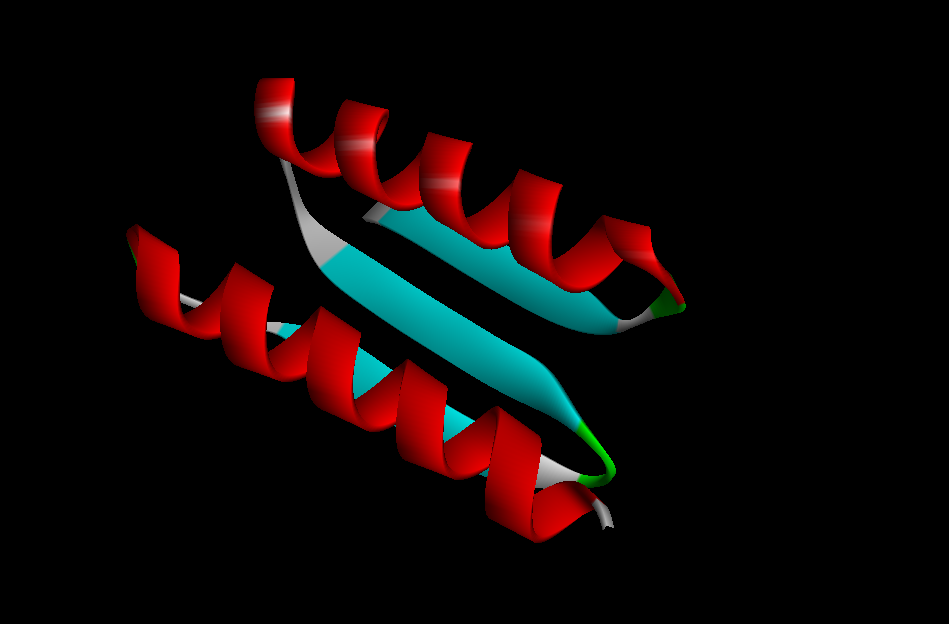
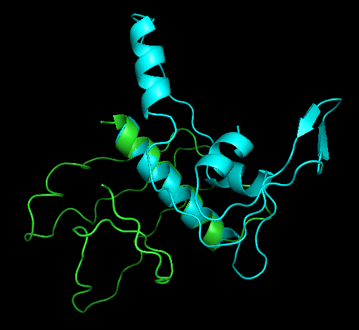
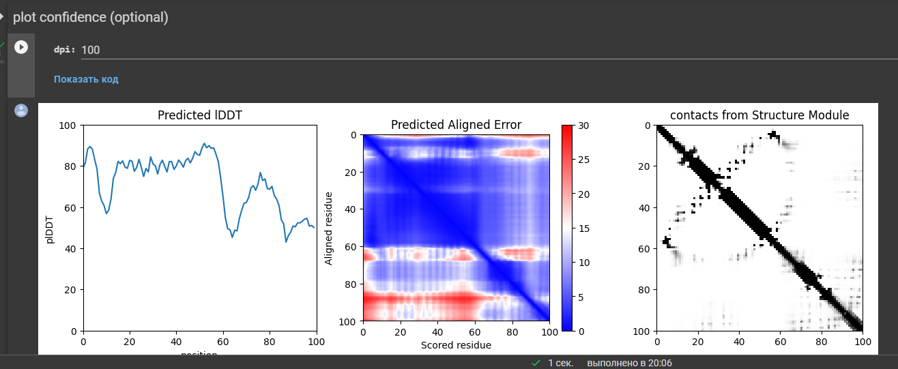

результаты выравнивания:  

openfold:  

esmfold:  

выравнивание  

Выравнивание выглядит откровенно говоря так себе, даже если смотреть просто на FASTA файл.  
Однако, возможно, нейросети сами немного запутились. Вот это графики из esmfold:  

Тепловая карта и график точности предсказания намекают, что модель отработала не очень хорошо. Так что 
такое качество выравнивания может быть связано исключительно с самим инструментом.
